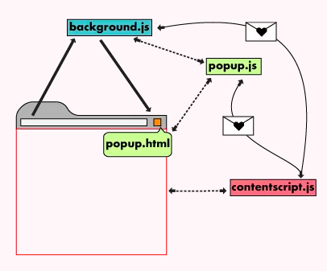

# HackRice 9 | First Timer's Track

## Track Description

We live in a society where everything is customized, from your phone case to your coffee order. So why shouldn't your browser be too? Chrome extensions allow you to craft and tailor your ideal browsing experience in a few short lines of code. In this track, you'll build a Chrome extension from scratch using HTML/CSS and JavaScript. 

## Introduction

Welcome to HackRice 9! This track is intended for teams in which a majority of members have little to no experience with software development. We'll help you get started by providing instructions on how to set up your environment and providing some basic code for you to expand on. If you have attended previous hackathons, you're still welcome to use the provided code, but you won't be eligible to compete in the First Timers Track.

In this track, you'll create a Google Chrome extension of your choice to add functionality to the Chrome browser. You can create an application from scratch hosted in Chrome, build a tool to enhance/customize your online experience, integrate an existing platform with your browser, or write content scripts to modify webpage content. We're only providing you with enough to create a very simple, working framework -- it's up to you to build off of the base code we provide and make it useful or add functionality to solve a real world problem. 

## Tools Needed

All you'll need for this extension is Google Chrome and a basic text editor - We recommend [sublime](https://www.sublimetext.com) or [VS Code](https://code.visualstudio.com). Chrome will handle rendering/testing the HTML, CSS, and JavaScript files.

## The Basics 

There are two main ways Chrome Extensions appear in the browser’s UI - Browser Actions and Page Actions.

Browser Actions are permanently displayed to the right of the address bar. These are good if your extension can work on any website, or if the extension is website agnostic. This is probably the right option for most extensions.<sup>1</sup>
Page Actions are only displayed on certain pages, and their icon appears inside the address bar. This is the right options for extensions that only operate on certain websites. Page Actions explicitly tell the user which websites they need permissions for.<sup>2</sup> Some examples use cases for page action extensions are subscribing to a page’s RSS feed or making a slideshow out of the page’s photos.

## BoilerPlates 
If you would like a popup boilerplate, clone the `boilerplate/HR9_New_Tab_Extension` directory.
  
If you would like a new tab boilerplate, clone the `boilerplate/HR9
_Popup` directory.
  
If there is a different type of boilerplate you would like, see [Extensionizr](https://extensionizr.com/!#%7B%22modules%22:[%22hidden-mode%22,%22with-bg%22,%22with-persistent-bg%22,%22no-options%22,%22no-override%22],%22boolean_perms%22:[],%22match_ptrns%22:[]%7D).

## Project Structure 
##### manifest.json 
The manifest.json file “is a JSON file that basically tells Chrome what’s in the extension. It can include the name and version of the extension, as well as links to other files like icons and background pages”.<sup>3</sup> A few of the important fields are:
* `permissions` array: includes URL(s) that the extension needs access to.
* `page_action` or `browser_action`: contains information about the extension’s UI. `default_icon` is the icon that appears in the URL bar on specified websites, and `default_popup` is the HTML content that appears when the icon is clicked.
* `chrome_url_overrides`: This field allows you to specify parameters that allow your application can override default features in Chrome. For example, adding `"newtab": "override.html"` in your manifest.json file will force Chrome to display the override.html file instead of the default new tab. You can also modify bookmarks and history in a similar manner. 

<p align="center">
  
</p>


##### Background Script
The background.js file is the extension’s event handler. It’s constantly listening for browser events, which you’ll feed to it using the Chrome Extension API. Google says that an effective background script is only loaded when it is needed and unloaded when it goes idle.<sup>4</sup> You will need to tell the manifest.json file about the background script by adding: 
```
"background": {
  "scripts": ["background.js"]
}
```
  
“The Popup is the little window that appears when you click on an extension’s icon in the Chrome Menu. It consists of markup and scripts, and you can tell the browser where to find it in the manifest.json under `page_action: { "default_popup": FILE_NAME_HERE }`.

The Options page is exactly as it says. This displays customizable options only visible to the user when they either right-click on the Chrome menu and choose “Options” under an extension. This also consists of markup and scripts, and you can tell the browser where to find it in the manifest.json under `options_page: FILE_NAME_HERE.”` <sup>5</sup>

##### Content Script 
Content scripts are any scripts that will interact with any web windows or tabs that the user has open. These scripts will also interact with any tabs or windows opened by your extension.<sup>6</sup> You will need to tell your `manifest.json` file about it by adding the following object: 
```
"content_scripts": [
  {
    "matches": [ // You can specify which pages to match here
      "<all_urls>" // This indicates it matches all pages
    ],
    "js": ["content.js"]
  }
]
```

## Loading Your Extension 
Once you have created your folder with the manifest.json file, you can load your chrome extension. To do so,
* Open a Google Chrome Browser.
* Navigate to chrome://extensions/
* In the upper right hand corner, enable the button called “Developer Mode”.
* Click the “Load Unpacked” button.
* A file dialog will popup asking you to locate your chrome extension folder. Once you have located the folder, select the folder, and then click “Select”.
* You should now see your extension!

As you are coding, to update the extension, all you need to do is save the file, and then click the refresh button in chrome://extensions. 

## Next Steps

Chrome extensions allow for a variety of customization. A few popular examples include: 
* [Momentum](https://chrome.google.com/webstore/detail/momentum/laookkfknpbbblfpciffpaejjkokdgca?hl=en): A personalized, inspirational, to-do dashboard that appears in every new tab. 
* [Dark Mode for Chrome](https://chrome.google.com/webstore/detail/dark-mode-for-chrome/geooakdjiamlhpechokegobmhdmlgidk?hl=en) 
A button to enable dark mode while browsing.

To help you get started, here are some more tutorials:
* [Read Time Price Tracking Tutorial](https://scotch.io/tutorials/build-a-chrome-extension-for-real-time-price-tracking-with-appbase)
* [Dashboard Tutorial](https://medium.com/javascript-in-plain-english/https-medium-com-javascript-in-plain-english-how-to-build-a-simple-chrome-extension-in-vanilla-javascript-e52b2994aeeb) 
* [Dashboard Tutorial](https://medium.com/javascript-in-plain-english/https-medium-com-javascript-in-plain-english-how-to-build-a-simple-chrome-extension-in-vanilla-javascript-e52b2994aeeb) 
* [jQuery Determiner Tutorial](https://www.thepolyglotdeveloper.com/2018/09/creating-basic-chrome-extension/)


## Resources 
* [Google Chrome Extension Documentation](https://developer.chrome.com/extensions/overview): This is a very comprehensive explanation of how Chrome extensions are built and the various functions extensions can have. You can look in [Google Provided Starter Examples](https://chromium.googlesource.com/chromium/src/+/master/chrome/common/extensions/docs/examples/tutorials/) for the starter code used in the examples. 
* [HTML Tutorial](https://html.com/): This tutorial covers the basics of HTML. 
* [CSS Tutorial](https://html.com/css/): This tutorial covers the basics of CSS.
* [Javascript Tutorial](https://www.htmldog.com/guides/javascript/): This simple and straightforward tutorial covers the basics of Javascript. Start by reading this [article](https://www.htmldog.com/guides/javascript/beginner/makingstuffhappen/) and then continue reading [here](https://www.htmldog.com/guides/javascript/intermediate/thedom/).
* [The Modern Javascript Tutorial](https://javascript.info/): This in-depth tutorial thoroughly covers Javascript.

## FAQ

## Footnotes

<sup>1,2</sup>: https://blog.hartleybrody.com/chrome-extension/

<sup>3,6</sup>: https://thoughtbot.com/blog/how-to-make-a-chrome-extension

<sup>4,5</sup>: https://24ways.org/2018/my-first-chrome-extension/ 
